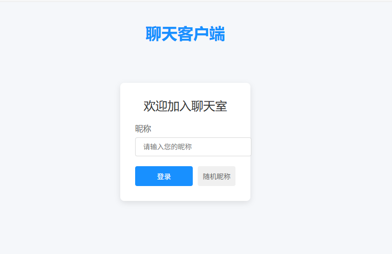
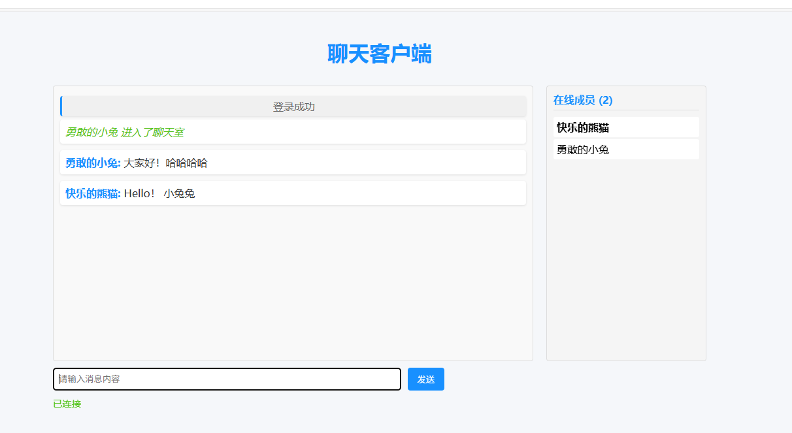

MiniChat - 一个简单的Go语言聊天室Demo

🚀 项目简介

MiniChat 是一个基于Go语言实现的轻量级实时聊天室Demo，使用WebSocket协议实现即时通讯功能。这个项目非常适合学习Go语言网络编程和WebSocket应用开发。

✨ 功能特性

• 实时消息广播

• 多用户同时在线聊天

• 简单的用户昵称设置

• 轻量级实现，代码简洁易懂

• 纯Go标准库实现，无额外依赖


📦 快速开始


安装运行

1. 克隆仓库：
   ```bash
   git clone https://github.com/beijian128/minichat.git
   cd minichat
   ```

2. 运行服务：
   ```bash
   go run main.go
   ```

3. 打开浏览器访问：
   ```
   http://localhost:8080
   ```

4. 要体验多人聊天，可以在多个浏览器窗口或不同设备上同时打开上述地址


## 界面展示








### 在线体验地址
 https://beijian99.top/minichat
